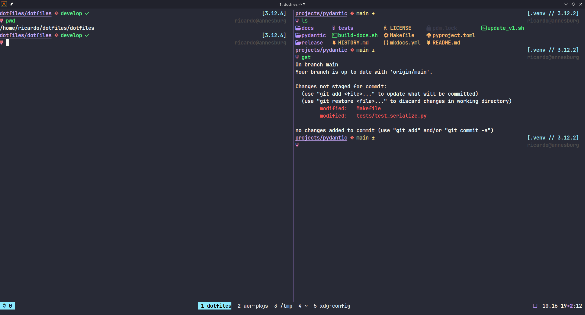
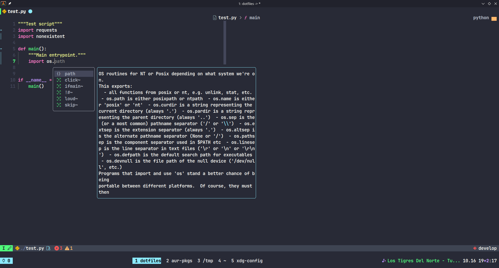

# Dotfiles

> A collection of configuration files for the tools/programs I use in my day to day programming journey.

This dotfiles provide configurations for [Zsh](https://www.zsh.org/), [Neovim](https://github.com/neovim/neovim), [Tmux](https://github.com/tmux/tmux), [Alacritty](https://github.com/alacritty/alacritty) (and some more). This configurations are "optimized" for developing in Python and Typescript (mainly React).

The color scheme used everywhere is [Dracula](https://github.com/dracula/dracula-theme).





## Pre-flight checks

Make sure to install:

- [asdf-vm](https://asdf-vm.com/#/core-manage-asdf?id=install)
- [vim-packager](https://github.com/kristijanhusak/vim-packager)
- [zplug](https://github.com/zplug/zplug#installation)
- [tpm](https://github.com/zplug/zplug#installation) (Optional, only if you plan to use Tmux [highly recommended])

And these `xstow xsel` using your package manager

## Installation

Just clone the repo and run Make

```
$ git clone git@github.com:richin13/dotfiles.git ~/dotfiles
$ cd ~/dotfiles
$ make dotfiles
```

# Aftermath

- (Map Caps Lock to Ctrl)[https://dev.to/tallesl/change-caps-lock-to-ctrl-3c4]

## Troubleshoot

You might run into some issues when running `make dotfiles`. Under the hood, make will
execute `xstow` to create the symlinks to the dotfiles. First make sure you have
installed `xstow`

```
# When in LinuxMint (or any Debian based distro)
$ sudo apt install -y xstow
```

### Mouse waking up the computer

Noticed Ubuntu 24 waking up from sleep when moving the mouse. Following this instructions fixes the issue:

```
The solution I'm using is a udev rule that disables wakeup from a particular USB device. It should be agnostic to which port the device is plugged in to.

Create /etc/udev/rules.d/90-usb-wakeup.rules with the following content (modify idVendor and idProduct as appropriate, see output from lsusb which gives the IDs in the form: vendor:product):

# Disable waking up from Logitech unified receiver
ACTION=="add", SUBSYSTEM=="usb", DRIVERS=="usb", ATTRS{idVendor}=="046d", ATTRS{idProduct}=="c52b", ATTR{power/wakeup}="disabled"

To get it applied without rebooting:

    Run:

    sudo udevadm control --reload-rules

    Disconnect and reconnect the USB device.

Inspiration comes from https://wiki.archlinux.org/title/udev#Waking_from_suspend_with_USB_device
```

https://askubuntu.com/a/1385877

Another issue you might run into is `xstow` not being able to create the symlinks. This
happens when the files already exists in you home directory and are not symlinks.
Make sure to backup your existing dotfiles before proceeding.

## License

See `LICENSE`
